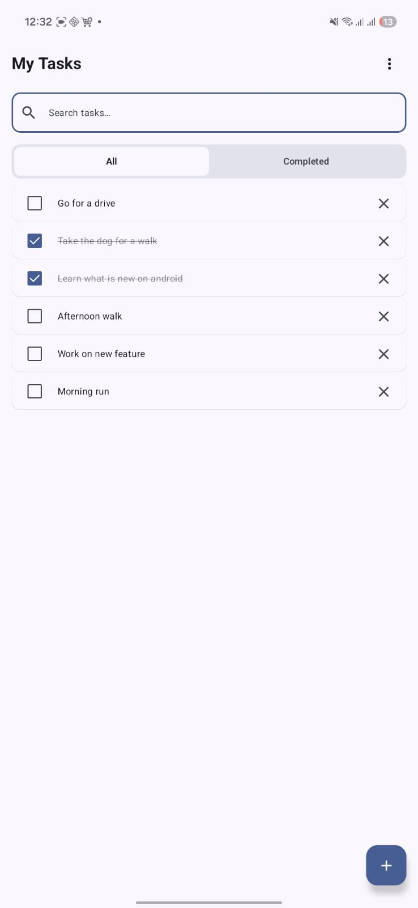
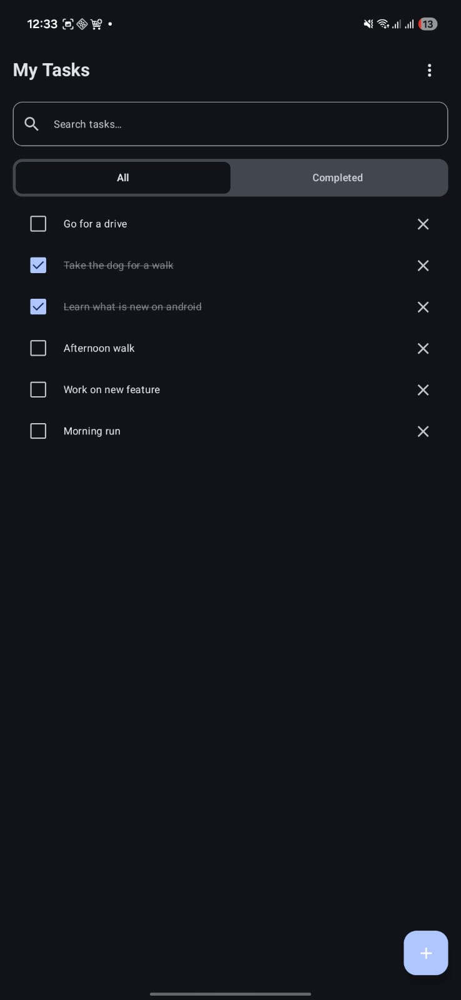
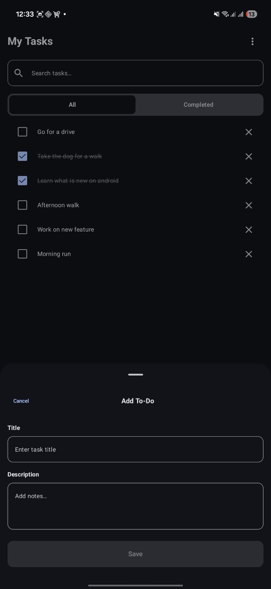
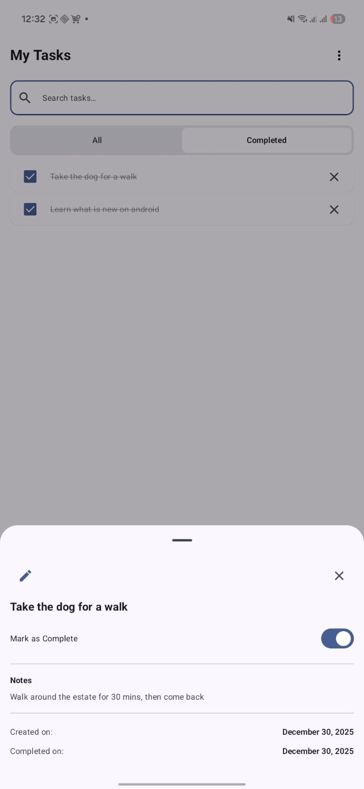
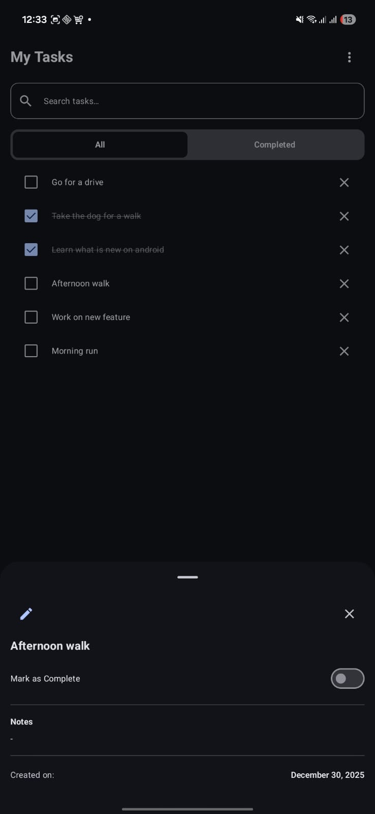
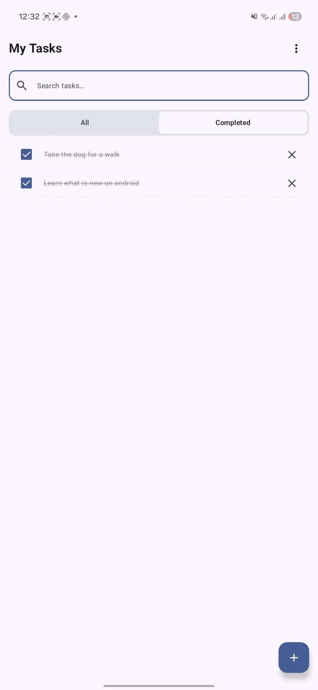
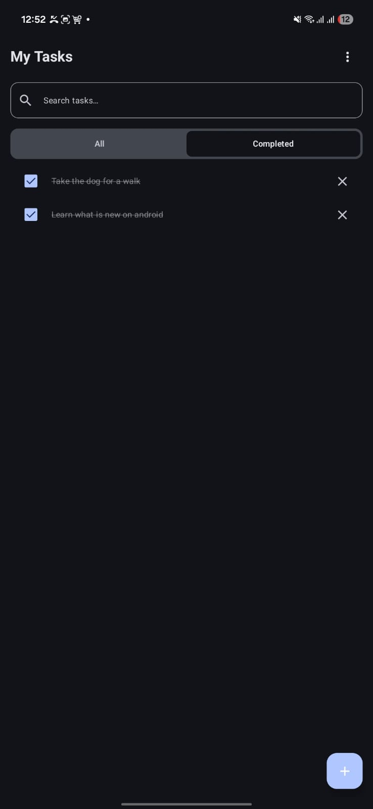

# SimpleTodoApp

A simple Todo Android app showcasing my skills in **MVI architecture**, **Jetpack Compose**, **Kotlin Coroutines & Flow**, **Room Database**, and **Hilt Dependency Injection**.

## Prerequisites

To run the project in your local environment, you need:
- **Android Studio** Ladybug (2024.2.1) or newer
- **JDK 17**
- **Android SDK 36**

### Clone & Build

```bash
# Clone the repository
git clone https://github.com/jlutukai/SimpleTodoApp.git

# Navigate to project directory
cd SimpleTodoApp

# Build debug APK
./gradlew assembleDebug

# Install on connected device
./gradlew installDebug
```

## Tech-stack

* [Kotlin](https://kotlinlang.org/) - a modern, cross-platform, statically typed, general-purpose programming language with type inference.
* [Coroutines](https://kotlinlang.org/docs/reference/coroutines-overview.html) - lightweight threads to perform asynchronous tasks.
* [Flow](https://kotlinlang.org/docs/reference/coroutines/flow.html) - a stream of data that emits multiple values sequentially.
* [StateFlow](https://developer.android.com/kotlin/flow/stateflow-and-sharedflow) - Flow APIs that enable flows to emit updated state and emit values to multiple consumers optimally.
* [Dagger Hilt](https://dagger.dev/hilt/) - a dependency injection library for Android built on top of [Dagger](https://dagger.dev/) that reduces the boilerplate of doing manual injection.
* [Jetpack](https://developer.android.com/jetpack)
    * [Jetpack Compose](https://developer.android.com/jetpack/compose) - A modern toolkit for building native Android UI
    * [Lifecycle](https://developer.android.com/topic/libraries/architecture/lifecycle) - perform actions in response to a change in the lifecycle state.
    * [ViewModel](https://developer.android.com/topic/libraries/architecture/viewmodel) - store and manage UI-related data lifecycle consciously and survive configuration changes.
    * [Room](https://developer.android.com/training/data-storage/room) - The Room persistence library provides an abstraction layer over SQLite to allow fluent database access while harnessing the full power of SQLite.
    * [Navigation Compose](https://developer.android.com/guide/navigation/navigation-getting-started) - Type-safe navigation with Kotlin Serialization.
* [Kotlinx Serialization](https://kotlinlang.org/docs/serialization.html) - Kotlin multiplatform serialization library for type-safe navigation arguments.

## Testing

Unit tests covering the data layer, domain use cases, and presentation layer.

* [JUnit 4](https://junit.org/junit4/) - Unit testing framework
* [MockK](https://mockk.io/) - Kotlin-first mocking library
* [Turbine](https://github.com/cashapp/turbine) - Flow testing library
* [Truth](https://truth.dev/) - Fluent assertions library (Google)
* [Robolectric](http://robolectric.org/) - JVM-based Android framework simulation

### Running Tests

```bash
# Run all unit tests
./gradlew test

# Run instrumented tests (requires connected device/emulator)
./gradlew connectedAndroidTest
```

## App Architecture

This app uses **Clean Architecture** with the **MVI (Model-View-Intent)** pattern. Read more about clean architecture [here](http://blog.cleancoder.com/uncle-bob/2012/08/13/the-clean-architecture.html).

### 1. Domain
The core layer of the application, independent of other layers.

* **Models**: Defines the core structure of the data (Todo).
* **Repository**: Interface defining the contract for data operations.
* **Use Cases**: Business logic handlers (GetAllTodos, GetTodoById, InsertTodo, UpdateTodo, DeleteTodo, DeleteCompletedTodos, ToggleTodoComplete).

### 2. Data
Responsible for providing data to the domain layer.

* **Local Database**: Room database with DAO for SQLite operations.
* **Repository Implementation**: Implements the domain repository interface.
* **Mappers**: Transform data between Entity and Domain models.

### 3. Presentation (UI)
Components involved in rendering information to the user using MVI pattern.

* **MVI Framework**: Custom implementation with MviContract, MviViewModel, and MviExtensions.
* **Screens**: TodoListScreen, AddEditTodoScreen, TodoDetailScreen.
* **ViewModels**: StateFlow for state management, Channel for one-time side effects.

## App Screenshots

| Todo List (Light) | Todo List (Dark) |
|-------------------|------------------|
|  |  |

| Create Todo (Light) | Create Todo (Dark) |
|---------------------|-------------------|
|  |  |

| View Todo (Light) | View Todo (Dark) |
|-------------------|------------------|
|  |  |

| Completed Todo (Light) | Completed Todo (Dark) |
|------------------------|----------------------|
|  |  |

## App Demo

**Watch the app walkthrough on YouTube:**

[](https://youtube.com/shorts/HqsfqGKS5zE)

## Download

[Download the APK here](https://github.com/jlutukai/SimpleTodoApp/releases)
